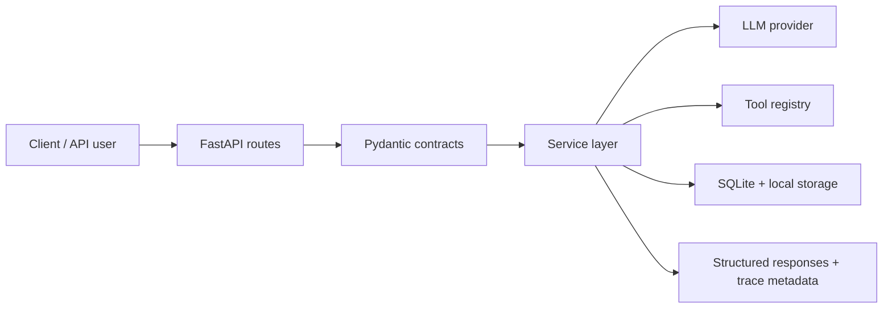

<h1 align="center">InsightAgent</h1>

Production-style FastAPI backend for AI-powered chat, controlled tool orchestration, safe CSV analysis, document RAG, evaluation pipelines, and observability.


## Overview and Why This Project Matters

InsightAgent is an end-to-end AI backend case study. It supports:
- chat and structured LLM responses
- controlled tool-calling agent workflows
- memory-aware sessions
- safe CSV upload and analysis
- document retrieval with citations
- evaluation and observability utilities

The project is built to show production-minded AI backend design: typed contracts, explicit service boundaries, validated model output, allowlisted execution, persistence, testability, and honest trade-offs.

## Current Status

**Current Version:** V10 - Portfolio Packaging + Cloud Run Deployment

The backend is portfolio-ready and deployed on Cloud Run. Public demo recording and final license choice are tracked as follow-up items in [docs/portfolio_status.md](docs/portfolio_status.md).

Live API:

```text
https://insightagent-1089133393572.us-central1.run.app
```

This is not a thin chat wrapper over an LLM API. It demonstrates backend patterns that make AI systems easier to trust, test, debug, and explain:
- structured outputs are validated before becoming API responses
- tools are model-selected but backend-enforced
- CSV analysis is allowlisted and safe (no arbitrary code execution)
- document answers are grounded with retrieval evidence and citations
- evaluation and observability make behavior measurable

## Core Capabilities

| Area | What It Proves |
| --- | --- |
| LLM API layer | Chat and structured responses with Pydantic validation, retry, and fallback behavior |
| Agent/tool layer | Controlled calculator, date/time, summarizer, file analyzer, and direct-answer paths |
| Memory layer | SQLite-backed sessions with bounded recent-context retrieval |
| CSV analysis layer | Upload validation, metadata tracking, intent routing, and safe analysis traces |
| Document Q&A layer | Text extraction, chunking, local embeddings, semantic retrieval, citations, and insufficient-context handling |
| Evaluation layer | JSONL eval cases, deterministic scoring, regression comparison, latency, and trace metadata |
| Observability layer | Request IDs, structured logs, tool traces, error categories, and metrics summaries |
| Deployment layer | Docker runtime, production env settings, API key auth, CORS, rate limiting, and readiness checks |

## Documentation

| Area | Description | Link |
| --- | --- | --- |
| Architecture overview | System design and request flow across layers | [docs/architecture.md](docs/architecture.md) |
| API examples | Ready-to-run request/response samples for main endpoints | [docs/api_examples.md](docs/api_examples.md) |
| Postman collection | Importable API playground for local and Cloud Run testing | [postman/README.md](postman/README.md) |
| Version journey | Version-by-version build progression from V1 to V10 | [docs/project_report.md](docs/project_report.md) |
| Trade-offs and limitations | Honest constraints, design choices, and future improvements | [docs/tradeoffs.md](docs/tradeoffs.md) |
| Portfolio status | What is complete now vs tracked follow-ups | [docs/portfolio_status.md](docs/portfolio_status.md) |
| Project report | Version-wise build history, learning notes, and outcomes | [docs/project_report.md](docs/project_report.md) |

## Architecture Summary



The model can propose structure and tool decisions, but backend services validate outputs, enforce allowlists, apply guardrails, and return predictable API shapes.

## Project Structure

```text
app/
|-- main.py
|-- config.py
|-- api/                  # routes, dependencies, middleware, CORS, rate limiting
|   |-- routes_health.py
|   |-- routes_chat.py
|   |-- routes_agent.py
|   |-- routes_session.py
|   |-- routes_datasets.py
|   |-- routes_documents.py
|   |-- dependencies.py
|   |-- middleware.py
|   `-- error_handlers.py
|-- db/                   # SQLite connection and schema setup
|   |-- database.py
|   `-- schema.py
|-- prompts/              # versioned prompt builders
|   |-- structured_v2.py
|   |-- tool_router_v3.py
|   `-- document_qa_v7.py
|-- schemas/              # Pydantic API contracts
|   |-- common.py
|   |-- chat.py
|   |-- structured.py
|   |-- agent.py
|   |-- tools.py
|   |-- session.py
|   |-- dataset.py
|   `-- document.py
|-- services/             # business and orchestration layers
|   |-- llm_service.py
|   |-- structured_llm_service.py
|   |-- memory_chat_service.py
|   |-- agent_controller.py
|   |-- dataset_*.py
|   |-- document_*.py
|   `-- readiness_service.py
|-- tools/                # allowlisted backend tools
|   |-- calculator.py
|   |-- date_time.py
|   |-- text_summarizer.py
|   |-- file_analyzer.py
|   `-- registry.py
`-- utils/
    `-- logger.py

docs/
|-- architecture.md
|-- api_examples.md
|-- deployment_guide.md
|-- project_report.md
|-- tradeoffs.md
|-- portfolio_status.md
`-- versions/             # v1 to v10 notes, technical walkthroughs, and commit logs

evals/
|-- evaluation_dataset.jsonl
`-- results/

postman/
|-- InsightAgent.postman_collection.json
|-- InsightAgent.local.example.postman_environment.json
`-- InsightAgent.cloud.example.postman_environment.json

scripts/
|-- run_eval.py
`-- metrics_summary.py

tests/
|-- conftest.py
|-- integration/
`-- unit/
```

## Quick Start

Install dependencies:

```bash
pip install -r requirements.txt
```

Create local environment values from `.env.example`, then set at least:

```text
API_KEY=<service-api-key>
LLM_API_KEY=<provider-api-key>
APP_VERSION=v10
```

Start the API:

```bash
uvicorn app.main:app --reload
```

Check health:

```bash
curl http://127.0.0.1:8000/health
```

Expected response:

```json
{
  "status": "ok",
  "service": "InsightAgent",
  "version": "v10"
}
```

Protected endpoints require an API key:

```powershell
$headers = @{ "x-api-key" = "your-service-api-key-here" }
```

## Docker

Build the image:

```powershell
docker build -t insightagent:v10 .
```

Run the container:

```powershell
docker run --rm -p 8000:8000 `
  -e API_KEY=your-service-api-key-here `
  -e LLM_API_KEY=your-llm-api-key-here `
  insightagent:v10
```

Production-oriented settings:

```text
APP_ENV=production
APP_VERSION=v10
DOCS_ENABLED=false
API_KEY=<service-api-key>
LLM_API_KEY=<provider-api-key>
CORS_ALLOWED_ORIGINS=<deployed-frontend-origin>
RATE_LIMIT_ENABLED=true
```

Keep `DOCS_ENABLED=false` in production unless interactive docs are intentionally exposed.

## Core API Surface

| Endpoint | Purpose | Auth |
| --- | --- | --- |
| `GET /health` | Public liveness check | No |
| `GET /ready` | Public dependency readiness check | No |
| `POST /chat` | Basic LLM chat | Yes |
| `POST /chat/structured` | Validated structured LLM response | Yes |
| `POST /agent/query` | Controlled tool-calling agent flow | Yes |
| `POST /sessions` | Create a memory session | Yes |
| `POST /chat/memory` | Memory-aware chat | Yes |
| `GET /sessions/{session_id}/messages` | Read session history | Yes |
| `POST /datasets/upload` | Upload CSV dataset | Yes |
| `GET /datasets/{dataset_id}/summary` | Dataset summary | Yes |
| `POST /datasets/{dataset_id}/ask` | Safe CSV analysis Q&A | Yes |
| `POST /documents/upload` | Upload document for Q&A | Yes |
| `POST /documents/{document_id}/ask` | Grounded document Q&A with citations | Yes |

Full request and response examples are in [docs/api_examples.md](docs/api_examples.md).

## Evaluation

Run the V8 evaluation dataset against a local API:

```powershell
.\.venv\Scripts\python scripts\run_eval.py `
  --base-url "http://127.0.0.1:8000" `
  --api-key "your-service-api-key-here"
```

The runner loads `evals/evaluation_dataset.jsonl`, executes API cases, scores responses, captures latency, records trace metadata, and writes results under `evals/results/`.

## Observability

Every request receives an `x-request-id` response header. Completion logs include endpoint, status code, success/failure, optional session id, latency, error category, and nullable token/cost fields when available.

Agent requests also emit tool trace logs with request id, selected tool, tool status, agent status, and output summary.

For local observability practice, start the API and redirect server output into `logs/app.log`:

```powershell
mkdir logs -ErrorAction SilentlyContinue
cmd /c ".venv\Scripts\uvicorn.exe app.main:app --reload > logs\app.log 2>&1"
```

Then hit endpoints from curl, Postman, or the evaluation runner. Generate a metrics summary from the captured log file:

```powershell
.\.venv\Scripts\python scripts\metrics_summary.py `
  --logs logs\app.log `
  --output logs\metrics_summary.json
```

The summary reports request totals, success/failure rate, endpoint counts, average latency, error categories, tool usage, and tool success/failure counts.

## Verification

Current automated test status:

```text
258 passed
```

The suite covers route contracts, services, schemas, tool behavior, dataset workflows, document Q&A, evaluation logic, error handling, auth, middleware, observability, and metrics summaries.

## Trade-Offs

InsightAgent intentionally favors clear local architecture over external infrastructure complexity. SQLite, deterministic local embeddings, rule-based evaluation checks, and in-memory rate limiting keep the project easy to run, inspect, and test while preserving production-style boundaries.

Managed databases/storage, managed vector databases, distributed rate limiting, model-assisted evaluation, richer file parsing, and frontend UX are documented as future improvements instead of hidden behind unfinished work.

See [docs/tradeoffs.md](docs/tradeoffs.md) for the full limitations and roadmap.
