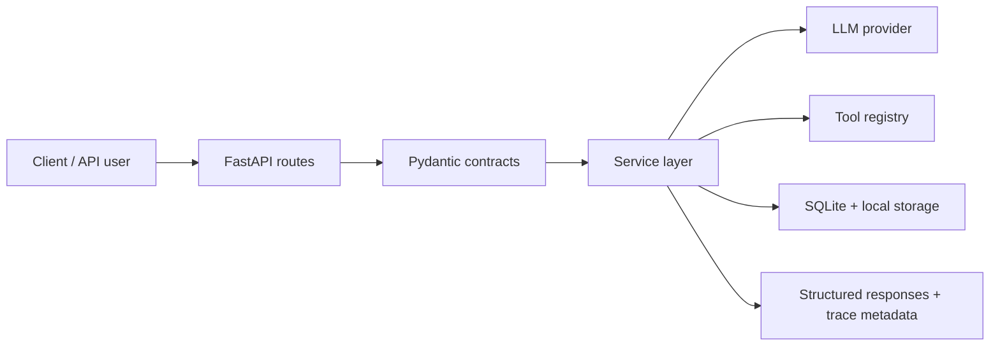

# InsightAgent

Production-style FastAPI backend for AI-powered chat, controlled tool orchestration, safe CSV analysis, document RAG, evaluation pipelines, and observability.


Python • FastAPI • Pydantic • SQLite • pandas • pytest • Docker

## Overview

InsightAgent is an end-to-end AI backend case study. It lets users chat with an LLM, request structured JSON responses, route questions through controlled tools, upload CSV files for safe analysis, and ask grounded questions over uploaded documents.

The project is designed to show how an LLM app can be built as a real backend system: typed API contracts, explicit service boundaries, validated model output, allowlisted tool execution, persistence, evaluation, request tracing, and honest deployment trade-offs.

## Why This Project Matters

This is not just a chat wrapper around an LLM API. The backend demonstrates the pieces that make AI applications easier to trust, test, debug, and explain:

- Structured outputs are validated before they become API responses.
- Tool calls are selected by the model but executed only through backend-approved tools.
- CSV analysis uses safe, allowlisted pandas operations instead of arbitrary Python execution.
- Document Q&A uses retrieval evidence, citations, and weak-context fallback.
- Evaluation and observability make behavior measurable instead of purely manual.

## Core Capabilities

| Area | What It Proves |
| --- | --- |
| LLM API layer | Chat and structured responses with Pydantic validation, retry, and fallback behavior. |
| Agent/tool layer | Controlled calculator, date/time, summarizer, file analyzer, and direct-answer paths. |
| Memory layer | SQLite-backed sessions with bounded recent-context retrieval. |
| CSV analysis layer | Upload validation, metadata tracking, intent routing, and safe analysis traces. |
| Document Q&A layer | Text extraction, chunking, local embeddings, semantic retrieval, citations, and insufficient-context handling. |
| Evaluation layer | JSONL eval cases, deterministic scoring, regression comparison, latency, and trace metadata. |
| Observability layer | Request IDs, structured logs, tool traces, error categories, and metrics summaries. |
| Deployment layer | Docker runtime, production env settings, API key auth, CORS, rate limiting, and readiness checks. |

## Documentation

| Area | Link |
| --- | --- |
| Architecture overview | [docs/architecture.md](docs/architecture.md) |
| API examples | [docs/api_examples.md](docs/api_examples.md) |
| Trade-offs and limitations | [docs/tradeoffs.md](docs/tradeoffs.md) |
| Portfolio status | [docs/portfolio_status.md](docs/portfolio_status.md) |
| Project report | [docs/project_report.md](docs/project_report.md) |

## Current Status

**Current Version:** V10 - Portfolio Packaging

The local and containerized backend is portfolio-ready. Cloud Run deployment, a public demo link, and license choice are intentionally tracked as follow-up items in [docs/portfolio_status.md](docs/portfolio_status.md).

## Architecture Summary



The LLM can propose structured output or tool decisions, but backend services validate responses, route only to allowlisted tools, enforce dataset/document guardrails, and return predictable API shapes.


## Version Journey

| Version | Focus |
| --- | --- |
| [V1](docs/versions/v1_fastapi_basic_chat.md) | FastAPI foundation and basic chat. |
| [V2](docs/versions/v2_structured_output.md) | Prompting and structured output validation. |
| [V3](docs/versions/v3_tool_calling_agentic.md) | Controlled tool-calling agent layer. |
| [V4](docs/versions/v4_memory_context.md) | Sessions, persistence, and memory-aware chat. |
| [V5](docs/versions/v5_data_analysis_assistant.md) | Safe CSV upload and analysis assistant. |
| [V6](docs/versions/v6_backend_maturity.md) | Auth, errors, CORS, rate limiting, Docker, and readiness. |
| [V7](docs/versions/v7_document_qa.md) | Document upload, retrieval, citations, and grounded Q&A. |
| [V8](docs/versions/v8_evaluation_layer.md) | Evaluation dataset, runner, scoring, and regression comparison. |
| [V9](docs/versions/v9_observability_metrics.md) | Request tracing, structured logs, and metrics summaries. |
| [V10](docs/versions/v10_portfolio_packaging.md) | Portfolio packaging, docs, README, status, and repo hygiene. |

## Project Structure

```text
app/
  api/          # routes, dependencies, middleware, errors, CORS, rate limiting
  db/           # SQLite connection and schema setup
  prompts/      # versioned prompt builders
  schemas/      # Pydantic API contracts
  services/     # LLM, memory, CSV, document, eval support logic
  tools/        # allowlisted backend tools
  utils/        # logging helpers

docs/           # portfolio docs, project report, version notes
evals/          # evaluation dataset
scripts/        # evaluation and metrics utilities
tests/          # unit and integration tests
```

## Quick Start

Install dependencies:

```bash
pip install -r requirements.txt
```

Create local environment values from `.env.example`, then set at least:

```text
API_KEY=<service-api-key>
LLM_API_KEY=<provider-api-key>
APP_VERSION=v10
```

Start the API:

```bash
uvicorn app.main:app --reload
```

Check health:

```bash
curl http://127.0.0.1:8000/health
```

Expected response:

```json
{
  "status": "ok",
  "service": "InsightAgent",
  "version": "v10"
}
```

Protected endpoints require an API key:

```powershell
$headers = @{ "x-api-key" = "your-service-api-key-here" }
```

## Docker

Build the image:

```powershell
docker build -t insightagent:v10 .
```

Run the container:

```powershell
docker run --rm -p 8000:8000 `
  -e API_KEY=your-service-api-key-here `
  -e LLM_API_KEY=your-llm-api-key-here `
  insightagent:v10
```

Production-oriented settings:

```text
APP_ENV=production
APP_VERSION=v10
DOCS_ENABLED=false
API_KEY=<service-api-key>
LLM_API_KEY=<provider-api-key>
CORS_ALLOWED_ORIGINS=<deployed-frontend-origin>
RATE_LIMIT_ENABLED=true
```

For production deployments, keep `DOCS_ENABLED=false` unless interactive API docs are intentionally exposed.

## Core API Surface

| Endpoint | Purpose | Auth |
| --- | --- | --- |
| `GET /health` | Public liveness check | No |
| `GET /ready` | Public dependency readiness check | No |
| `POST /chat` | Basic LLM chat | Yes |
| `POST /chat/structured` | Validated structured LLM response | Yes |
| `POST /agent/query` | Controlled tool-calling agent flow | Yes |
| `POST /sessions` | Create a memory session | Yes |
| `POST /chat/memory` | Memory-aware chat | Yes |
| `GET /sessions/{session_id}/messages` | Read session history | Yes |
| `POST /datasets/upload` | Upload CSV dataset | Yes |
| `GET /datasets/{dataset_id}/summary` | Dataset summary | Yes |
| `POST /datasets/{dataset_id}/ask` | Safe CSV analysis Q&A | Yes |
| `POST /documents/upload` | Upload document for Q&A | Yes |
| `POST /documents/{document_id}/ask` | Grounded document Q&A with citations | Yes |

Full request and response examples are in [docs/api_examples.md](docs/api_examples.md).

## Evaluation

Run the V8 evaluation dataset against a local API:

```powershell
.\.venv\Scripts\python scripts\run_eval.py `
  --base-url "http://127.0.0.1:8000" `
  --api-key "your-service-api-key-here"
```

The runner loads `evals/evaluation_dataset.jsonl`, executes configured API cases, scores responses, captures latency, records trace metadata, and writes local results under `evals/results/`.

Current evaluation coverage includes chat response shape, structured output, tool correctness, CSV analysis intent, RAG citation checks, groundedness checks, and insufficient-context safety.

## Observability

Every request receives an `x-request-id` response header. Request completion logs include endpoint, status code, success/failure status, optional session id, latency, error category, and nullable token/cost fields when available.

Agent requests also emit tool trace logs with request id, selected tool, tool status, agent status, and output summary.

Summarize structured logs:

```powershell
.\.venv\Scripts\python scripts\metrics_summary.py `
  --logs logs\app.log `
  --output logs\metrics_summary.json
```

The summary reports request totals, success/failure rate, endpoint counts, average latency, error categories, tool usage, tool success/failure counts, and usage totals when log events expose them.

## Verification

Current automated test status:

```text
247 passed
```

The test suite covers route contracts, services, schemas, tool behavior, dataset workflows, document Q&A, evaluation logic, error handling, auth, request middleware, observability, and metrics summaries.

Portfolio packaging status is tracked in [docs/portfolio_status.md](docs/portfolio_status.md).

## Trade-Offs

InsightAgent intentionally favors clear local architecture over external infrastructure complexity. SQLite, deterministic local embeddings, rule-based evaluation checks, and in-memory rate limiting keep the project easy to run, inspect, and test while still showing production-style boundaries.

Cloud deployment, managed vector databases, distributed rate limiting, model-assisted evaluation, richer file parsing, and frontend UX are documented as future improvements instead of hidden behind unfinished implementation.

See [docs/tradeoffs.md](docs/tradeoffs.md) for the full limitations and roadmap discussion.
