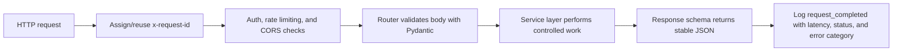
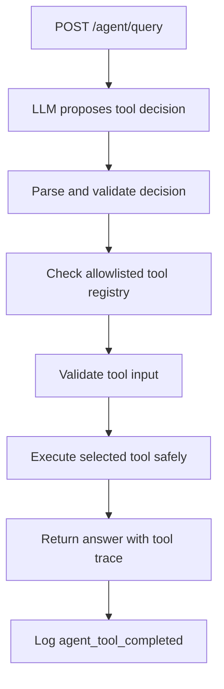
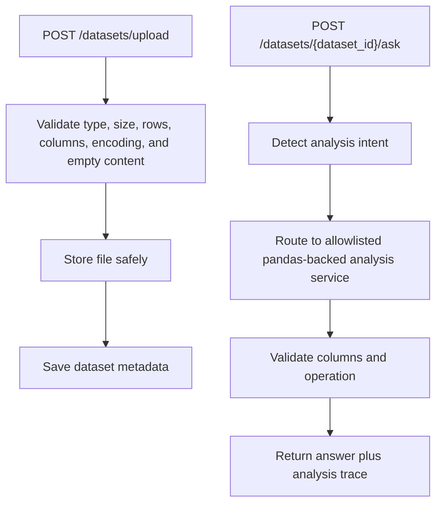
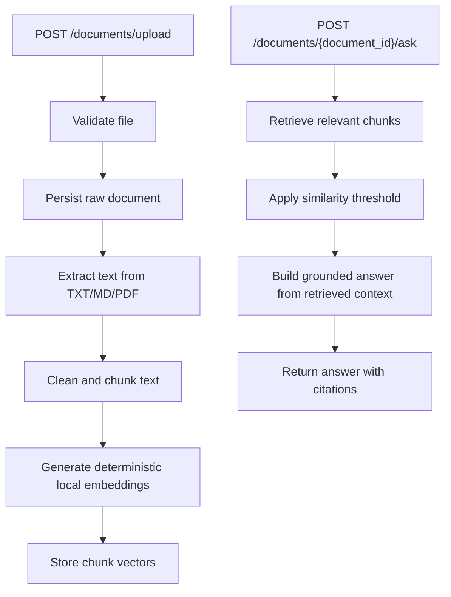

# InsightAgent Architecture

InsightAgent is a production-style FastAPI backend for AI-powered chat, tool calling, CSV analysis, document Q&A, evaluation, and observability.

## High-Level Flow

```mermaid
flowchart TD
    Client["Client / API user"] --> App["FastAPI application"]

    App --> Middleware["API middleware"]
    Middleware --> RequestId["Request ID"]
    Middleware --> RequestLogs["Structured request logging"]
    Middleware --> Cors["CORS"]
    Middleware --> RateLimit["Rate limiting"]

    App --> Routers["API routers"]
    Routers --> Health["Health / readiness"]
    Routers --> Chat["Chat / structured chat"]
    Routers --> Agent["Agent query"]
    Routers --> Sessions["Sessions and memory"]
    Routers --> Datasets["CSV datasets"]
    Routers --> Documents["Documents and RAG"]

    App --> Services["Service layer"]
    Services --> Llm["LLM calls"]
    Services --> AgentController["Agent controller"]
    Services --> Memory["Memory/session services"]
    Services --> Csv["Dataset analysis services"]
    Services --> Rag["Document indexing/retrieval services"]

    App --> Persistence["Persistence"]
    Persistence --> Sqlite["SQLite metadata and message history"]
    Persistence --> Uploads["Local upload storage"]
    Persistence --> Vectors["SQLite-backed local vector storage"]

    App --> Output["Structured API responses + logs + eval results"]
```

## Main Components

| Area | Responsibility |
| --- | --- |
| `app/main.py` | Builds the FastAPI app, registers middleware, and includes routers. |
| `app/config.py` | Loads environment-driven configuration through Pydantic settings. |
| `app/api/` | Owns HTTP routes, auth dependency, CORS, rate limiting, error handling, and request logging. |
| `app/schemas/` | Defines stable Pydantic contracts for request and response bodies. |
| `app/services/` | Contains business logic for LLM calls, memory, CSV analysis, document indexing, retrieval, evaluation support, and readiness checks. |
| `app/tools/` | Holds allowlisted tools used by the agent controller. |
| `app/db/` | Initializes SQLite tables for sessions, messages, datasets, documents, and vectors. |
| `scripts/` | Contains operational scripts for evaluation and metrics summaries. |
| `tests/` | Contains unit and integration coverage for API behavior and internal services. |

## Request Lifecycle

Private endpoints require `x-api-key`. Public endpoints such as `/health` and `/ready` remain available for health checks.

## Agent Workflow

The agent can use:
- `calculator`
- `date_time`
- `text_summarizer`
- `file_analyzer`
- `none` path for direct answers

Tool execution is backend-controlled. The LLM does not execute arbitrary Python.

## CSV Analysis Workflow

Supported analysis paths include dataset summary, missing values, column statistics, value counts, and groupby aggregation.

## Document Q&A Workflow

Weak retrieval returns an insufficient-context response instead of a confident unsupported answer.

## Evaluation And Observability

Evaluation:
- `evals/evaluation_dataset.jsonl` stores evaluation cases.
- `scripts/run_eval.py` runs local/deployed API cases.
- Results include pass/fail, score breakdowns, latency, optional usage metadata, and request trace ids.

Observability:
- every request receives an `x-request-id`
- request logs include endpoint, status, latency, error category, optional session id, and nullable usage fields
- agent logs include tool used and tool status
- `scripts/metrics_summary.py` summarizes request, error, latency, tool, and usage metrics from logs

## Key Trade-Offs

- SQLite keeps local development simple; PostgreSQL would be a better production database.
- Local file storage is easy to inspect; cloud object storage would be better for multi-instance deployments.
- Deterministic local embeddings make tests reliable; production RAG may benefit from managed embedding APIs or vector databases.
- API key auth is simple and suitable for a backend demo; OAuth/JWT would be stronger for user-level access control.
- Rule-based evaluation is deterministic; LLM-as-judge could add semantic scoring later.
- Controlled tool execution is safer than arbitrary Python execution, but intentionally limits flexibility.
